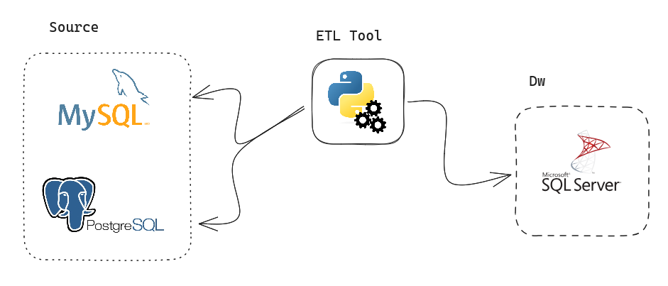

# Traditional Dw Etl

---

### Introduction

---

Simple ETL Tool for extract data from MySQL and PostgreSQL and storange on SQL Server. This example I have used Olist Kaggle Dataset and make a simple star schema model.

- Olist Dataset: https://www.kaggle.com/datasets/olistbr/brazilian-ecommerce
- Star Schema Article: https://learn.microsoft.com/en-us/power-bi/guidance/star-schema

The inspiration for this repository was native data integration tools like Talend and Pentaho.
With them we can easily do a lot of things without having to write a lot of code, so the idea was to try to do something similar writing in Python.

I tried to develop a solution with asynchronous loads of tables, for quick loads it works very well, I also put a functionality to include a certain processing date (cutoff date for collecting data from the source) so it is possible to limit and make the query faster for the load avoiding several problems.

In a simple Zoom-In on geral pileine whe get this simple process on image:

There is a folder called "sql", it could be any name, and inside it there are some more subfolders where the queries in SQL to be executed in the database, the stagings folder and schemas (modeling) sql query.
As we are working on a batch project where the idea is not to load everything from the source and update the Dw/Dm tables, in this case there is the possibility of applying a data filter on the queries to be collected from the OLTP system.
That is, we will collect data with a time window, for example the last 15 days, or the last 5 days, etc. only the updated data, to update the history that has been fully loaded before and is in the dimensions and facts.
For Dims and Facts, I need to insert new rows and update existing ones based on this window or full extraction of sources, but I need to keep history on Dm.
If source change or broken, all the historical data is inside schema table on Dm/Dw.

### Tools Used

---

Sql is the principal tool for this project, I have created all modeling and extraction based on sql query. 

Python Packages:
- `sqlalchemy` Package for SqlServer connection.
- `databases` Package for geral async databases connection.
- `aiomysql / asyncpg` Packages for async Mysql and Postgresql.
- `pandas` Package for data insert to Sql Server (Possible another backend insert like "Dask" with parallel insert).
- `memory-profiler` Package for memory monitoring.

For this solution I used docker containers for postgresql, mysql and sqlserver.
